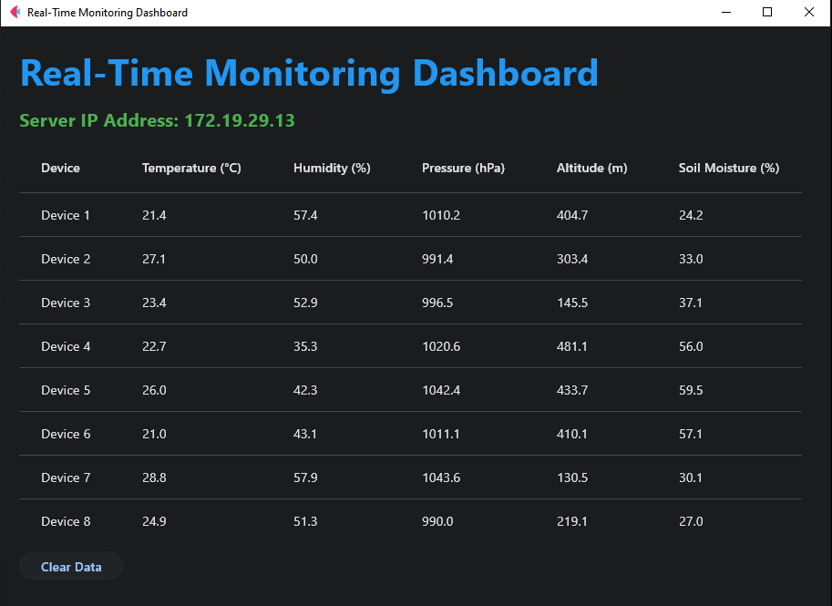

# **Low-Cost IoT Sensor Node for Agricultural and Environmental Monitoring**  

#### **Overview**
This project presents a low-cost IoT sensor node designed for real-time agricultural and environmental monitoring. It integrates the Raspberry Pi Pico W, various sensors, and a user-friendly dashboard to provide accurate and timely data for informed decision-making.

---

#### **Features**
- **Real-Time Data Collection**: Monitors temperature, humidity, pressure, altitude, and soil moisture.  
- **IoT-Enabled Transmission**: Utilizes Wi-Fi for seamless data communication to a Flask server.  
- **Interactive Dashboard**: Visualizes environmental data dynamically using Flet.  
- **Cost-Effective Solution**: Affordable hardware components ensure accessibility for a wide range of users.  

---

#### **Folder Structure**
```
Low-Cost-IoT-Sensor-Node-for-Agricultural-and-Environmental-Monitoring/
├── Dashboard-integrated-Server/
│   ├── dashboard.py  # Flet dashboard source code
│   ├── testing.py #Python code to test the working of the dashboard using random inputs through api to simluate the working of the IOT device
├── RaspberryPi/
│   ├── main.py  # MicroPython script for Pico W
├── images/
│   ├── dashboard.png  # Screenshot of the dashboard
├── README.md
```

---

### Dashboard Preview
Below is a preview of the real-time monitoring dashboard:



---

#### **Prerequisites**
1. **Hardware**:
   - Raspberry Pi Pico W  
   - AHT25 Sensor (Temperature & Humidity)  
   - BMP280 Sensor (Pressure & Altitude)  
   - Capacitive Soil Moisture Sensor  

2. **Software**:
   - Python 3.9 or above  
   - Required Python libraries: `flet`, `flask`, `json`, `threading`, `time`, `machine`, `network`, `ujson`, `usocket`  

---

#### **Setup and Usage**
1. **Hardware Setup**:  
   - Connect the AHT25, BMP280, and soil moisture sensors to the Raspberry Pi Pico W as per their specifications.  
   - Ensure the power supply and wiring are configured correctly.  

2. **MicroPython Code**:  
   - Navigate to the `RaspberryPi/` folder.  
   - Flash the `main.py` script to your Raspberry Pi Pico W using a tool like Thonny.  
   - Update Wi-Fi credentials and Flask server IP in the script.

3. **Server and Dashboard**:  
   - Navigate to the `Dashboard-integrated-Server/` folder.  
   - Run the `dashboard.py` script to start the Flask server and the Flet dashboard:  
     ```bash
     flet run dashboard.py
     ```

4. **Monitor Data**:  
   - Access the real-time data on the Flet dashboard.  

---

#### **Key Components**
- **Raspberry Pi Pico W**: Microcontroller for data collection and transmission.  
- **Sensors**:  
  - **AHT25**: Measures temperature and humidity.  
  - **BMP280**: Measures atmospheric pressure and altitude.  
  - **Capacitive Soil Moisture Sensor**: Monitors soil moisture levels.  

- **Flask Server**: Receives data from Pico W and updates the dashboard.  
- **Flet Dashboard**: Displays real-time environmental data.  

---

#### **Acknowledgments**
Special thanks to open-source communities and IoT enthusiasts for their contributions and support.  

#### **License**
This project is licensed under the MIT License. See the `LICENSE` file for details.
